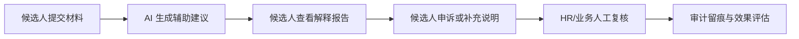

# HireTrust AI：候选人透明度与申诉看板

HireTrust AI 是一个面向校园招聘场景的 AI 辅助招聘透明化原型，目标不是让 AI 替代 HR 做决定，而是把 AI 参与招聘时的依据、限制、申诉入口和人工复核责任展示清楚。它回应的核心问题是：企业希望延续 AI 带来的流程效率，但候选人担心 AI 黑箱导致岗位错配、薪资沟通不公平或争议面评无法解释。

系统以“候选人透明度”为前台主线，以“HR/业务人工复核”和“审计留痕”为后台支撑。候选人可以看到系统使用了哪些材料、没有使用哪些敏感因素、岗位参考匹配度如何生成、证据充分度是否足够，以及如何提交补充说明。HR 与业务负责人可以查看候选人申诉、记录人工终审动作，并通过事件时间线复盘完整流程。

## 在线 Demo

实时更新版本：

https://hiretrust-ai-recruitment-demo-x7v9lzoxy4k5krvajdufxk.streamlit.app/

该在线版本连接 GitHub 仓库，代码更新后会随 Streamlit Community Cloud 自动重新部署。展示前建议刷新页面，并用“无 / 无 / 无”的低信息输入检查是否显示“待补充”。

## 产品闭环



## 核心能力

- 候选人透明看板：展示岗位推荐范围、参考匹配度、材料证据、证据充分度和解释说明。
- 系统使用信息说明：仅使用候选人主动提交的经历、技能、项目、岗位偏好和补充说明。
- 敏感因素排除：不使用性别、年龄、外貌、家庭背景、地域刻板印象、与岗位能力无关的学校标签等因素。
- 候选人申诉闭环：记录申诉编号、申诉类型、补充说明、提交时间和处理状态。
- HR/业务人工复核：支持维持建议、调整推荐岗位、要求补充材料、转业务负责人复核或暂不采纳 AI 建议。
- 审计日志：以事件时间线展示候选人提交、AI 建议、解释报告查看、申诉和人工复核过程。
- 效果评估面板：展示申诉数、待复核数、人工复核覆盖、解释报告查看状态和 AI 自动决策次数。

## 角色视角

候选人视角强调“知道 AI 做了什么、没做什么、如何提出异议”。页面会优先展示系统会使用的信息和不会使用的信息，再展示岗位参考匹配度、证据充分度、能力标签解释、薪资沟通参考维度和申诉入口。

HR/业务负责人视角强调“AI 只做建议，人工必须终审”。页面展示 AI 建议摘要、候选人申诉内容、待复核申诉数量、HR 终审动作和人工意见，避免把 AI 建议包装成最终结论。

审计与效果评估视角强调“可解释、可申诉、可复盘、可追责”。系统会保留每条申诉和每次 HR 复核的事件记录，并明确 AI 自动决策次数为 0。

## 技术实现

- Python
- Streamlit
- 本地 Mock AI 规则引擎
- pytest

当前版本使用本地 Mock AI 模拟岗位匹配和解释生成，不连接真实招聘数据库，不调用真实 API，也不上传真实简历。这样可以稳定演示完整产品逻辑，并把重点放在流程设计、责任边界和候选人信任机制上。真实落地时，可将 Mock 规则替换为 LLM、RAG、企业 ATS 系统或招聘规则引擎。

## Vibe Coding 迭代记录

- V1：生成基础 Streamlit 原型，验证 AI 辅助招聘透明化 Demo 的可行性。
- V2：发现原型偏 HR 内部视角，调整为候选人透明度与申诉看板。
- V3：增加候选人申诉入口、敏感因素排除说明和雇主品牌承诺。
- V4：补齐 HR/业务人工复核、审计日志和责任边界，形成完整闭环。
- V5：补充测试、依赖文件和文案检查，避免 AI 被表达成自动淘汰、自动定岗或自动定薪。
- V6：将容易被误解的模型判断表述改为“证据充分度”，升级审计日志为事件时间线，并增加效果评估面板。
- V7：整理项目结构和说明文档，使仓库更适合被评审快速理解。

## 运行方式

```bash
conda create -n hiretrust-ai python=3.10 -y
conda activate hiretrust-ai
pip install -r requirements.txt
streamlit run recruit_ai_demo/app.py
```

运行测试：

```bash
python -m pytest
```

## 关键边界

本系统不进行真实招聘决策。AI 只提供辅助建议、证据整理和复盘支持，不自动淘汰候选人，不自动决定 Offer，不自动定岗，不自动定薪。所有关键决策均需 HR 与业务负责人共同确认。

参考匹配度只表示当前材料与岗位要求之间的匹配程度，不代表能力高低，不代表录用结果，也不作为 Offer、定岗或定薪的唯一依据。薪资相关内容只展示可能影响薪资沟通的经历维度，最终薪资必须由 HR 与业务负责人结合面谈、岗位预算和公司制度确认。

## 设计文档

核心设计说明见：

`recruit_ai_demo/DESIGN.md`
